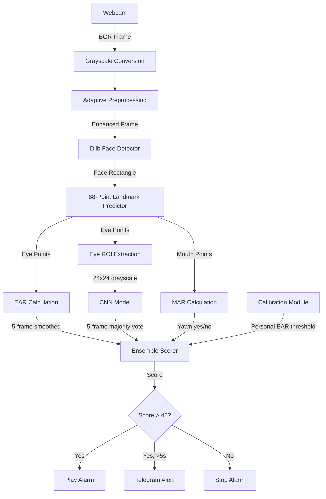

# 🚗 Drowsiness Detection System — Complete Presentation Guide

**Project Title:** Real-Time Driver Drowsiness Detection System using Deep Learning and Computer Vision  
**Date:** April 22, 2026 | **Semester:** 8th  
**Student:** Rajdeepsinh

---

## 📌 TABLE OF CONTENTS

| # | Section | Quick Jump |
|---|---------|------------|
| 1 | [Project Overview (What & Why)](#1--project-overview-what--why) | What problem, what solution |
| 2 | [Technologies Used (Why Each One)](#2--technologies-used-why-each-one) | Every library explained |
| 3 | [Project Folder Structure](#3--project-folder-structure) | What each file does |
| 4 | [System Architecture & Flow](#4--system-architecture--flow) | How data moves |
| 5 | [Key Concepts You Must Know](#5--key-concepts-you-must-know) | EAR, MAR, CNN, CLAHE etc. |
| 6 | [FILE-BY-FILE Line-by-Line Code Explanation](#6--file-by-file-line-by-line-code-explanation) | Every line explained |
| 7 | [How to Run the Project](#7--how-to-run-the-project) | Step-by-step |
| 8 | [Examiner Questions & Answers (50+)](#8--examiner-questions--answers-50) | Be fully prepared |

---

## 1. 🔍 Project Overview (What & Why)

### 🎯 What Is This Project?
This is a **Real-Time Driver Drowsiness Detection System** that uses a **webcam** to monitor a driver's face and detect signs of drowsiness (sleepy eyes, yawning). When drowsiness is detected, it:

1. **Plays a loud alarm sound** to wake the driver
2. **Sends a Telegram message** with a snapshot photo + GPS location to an emergency contact
3. **Shows visual warnings** on screen (red "DROWSY!" text, color-coded score bar)

### ❓ Why Is This Important?
- **1.35 million** people die annually in road accidents worldwide (WHO)
- **20-30%** of all fatal crashes are caused by drowsy driving
- Existing car systems are **expensive** and not available in most vehicles
- Our system uses just a **laptop camera** — making it **affordable and accessible**

### 💡 What Makes This Project Unique?
| Feature | Description |
|---------|-------------|
| **Dual Detection (Ensemble)** | Uses BOTH geometric (EAR/MAR) + Deep Learning (CNN) — not just one |
| **Adaptive Preprocessing** | Works in dark, bright, and normal lighting automatically |
| **Personalized Calibration** | Calibrates to YOUR face at startup — no one-size-fits-all threshold |
| **Yawn Detection** | Detects yawning as an early sign of fatigue |
| **Telegram Alerts** | Sends photo + Google Maps location to emergency contact |
| **Temporal Smoothing** | Uses 5-frame rolling averages to prevent false alarms |
| **Hysteresis Logic** | Prevents alarm from turning on/off rapidly at boundary scores |

---

## 2. 🛠 Technologies Used (Why Each One)

| Technology | Version | Why We Use It |
|------------|---------|---------------|
| **Python** | 3.10+ | Easy to learn, huge ML/CV library support |
| **OpenCV** (`cv2`) | 4.x | Industry standard for real-time video processing, frame capture, image manipulation |
| **PyTorch** | 2.x | Deep learning framework to build and run CNN model. Preferred over TensorFlow for research flexibility |
| **dlib** | 19.x | Provides HOG-based face detector + **68-point facial landmark predictor** — the backbone of EAR/MAR |
| **NumPy** | 1.x | Fast array math for image processing, EAR/MAR calculations |
| **SciPy** | 1.x | `distance.euclidean()` for precise point-to-point distance (EAR/MAR formulas) |
| **imutils** | 0.5.x | Helper to convert dlib shapes to NumPy arrays (`face_utils.shape_to_np`) |
| **Pygame** | 2.x | Audio playback — plays `alarm.wav` in a loop when drowsy |
| **Pillow** (PIL) | 10.x | Image format conversion for PyTorch transforms pipeline |
| **Requests** | 2.x | HTTP calls to Telegram Bot API and IP-API (for location) |
| **torchvision** | 0.x | Provides `transforms.Compose` pipeline for image preprocessing before CNN |
| **cmake** | — | Required dependency to compile dlib from source on Windows |

### Why Not TensorFlow/Keras?
PyTorch gives us **more control** over the training loop, is **easier to debug** (eager execution), and is the **standard in research**.

### Why dlib Instead of MediaPipe?
dlib's 68-point landmark model gives us **precise eye and mouth point coordinates** needed for EAR/MAR calculation. MediaPipe is faster but doesn't give the same landmark indexing compatibility.

---

## 3. 📁 Project Folder Structure

```
8th final project/
│
├── main.py                  ← 🚀 MAIN FILE: Runs the detection system
├── model.py                 ← 🧠 CNN architecture definition (DrowsinessCNN)
├── train.py                 ← 🎓 Script to train the CNN model
├── config.py                ← ⚙️ All tunable parameters (thresholds, API keys)
├── alert_system.py          ← 📱 Telegram + Email notification system
├── data_collector.py        ← 📸 Utility to collect eye dataset from webcam
├── download_dataset.py      ← ⬇️ Downloads MRL Eye Dataset from Kaggle
├── create_alarm.py          ← 🔊 Generates the alarm.wav sound file
├── generate_report_images.py← 📊 Creates diagrams for project report
│
├── drowsines_model.pth      ← 💾 Trained CNN model weights (442 KB)
├── alarm.wav                ← 🔔 Alarm sound file (88 KB)
├── requirements.txt         ← 📦 Python dependencies list
│
├── shape_predictor_68_face_landmarks.dat  ← 🗺️ dlib's 68-point model (99 MB)
├── haarcascade_frontalface_default.xml    ← 👤 OpenCV face detector
├── haarcascade_eye.xml                    ← 👁️ OpenCV eye detector
├── haarcascade_mcs_mouth.xml              ← 👄 OpenCV mouth detector
├── lbfmodel.yaml                          ← Face alignment model
│
├── dataset/                 ← 📂 Training data
│   ├── Open/                ←  Eye-open images
│   └── Closed/              ←  Eye-closed images
│
├── report_images/           ← 📊 Generated diagrams for report
├── .venv/                   ← 🐍 Python virtual environment
└── __pycache__/             ← 🗑️ Python bytecode cache
```

---

## 4. 🏗 System Architecture & Flow

### High-Level Flow (What happens every frame)

```
┌──────────────────────────────────────────────────────────────────────┐
│                        SYSTEM FLOW (Per Frame)                       │
└──────────────────────────────────────────────────────────────────────┘

  WEBCAM → Capture Frame
              │
              ▼
  Convert to GRAYSCALE
              │
              ▼
  ADAPTIVE PREPROCESSING ──→ Gamma Correction → Bilateral Filter → CLAHE
              │
              ▼
  DLIB FACE DETECTION (HOG) + 68-Point Landmarks
              │
              ├─────────────────────┬──────────────────────┐
              ▼                     ▼                      ▼
  ┌──────────────────┐  ┌──────────────────┐  ┌─────────────────────┐
  │  EAR Calculation │  │  MAR Calculation │  │  Eye ROI → CNN      │
  │  (Geometric)     │  │  (Yawn Check)    │  │  (Deep Learning)    │
  │                  │  │                  │  │                     │
  │  Smoothed over   │  │  If MAR > 0.6   │  │  Majority vote over │
  │  5 frames        │  │  for 15 frames   │  │  5 frames           │
  └──────┬───────────┘  └───────┬──────────┘  └──────────┬──────────┘
         │                      │                        │
         └──────────────────────┼────────────────────────┘
                                │
                                ▼
                    ┌─────────────────────┐
                    │  ENSEMBLE SCORING   │
                    │                     │
                    │  Both closed → +3   │
                    │  Only EAR    → +1   │
                    │  Only CNN    → +1   │
                    │  Yawn        → +1   │
                    │  Eyes open   → -2   │
                    └──────────┬──────────┘
                               │
                               ▼
                    ┌─────────────────────┐
                    │  Score > 45?        │
                    │  (with hysteresis)  │
                    └──────────┬──────────┘
                       YES ←──┤──→ NO
                       │            │
                ┌──────┴──────┐     └→ Stop alarm, reset
                │   DROWSY!   │
                ├─────────────┤
                │ 🔊 Alarm    │
                │ 📸 Snapshot  │
                │ 📱 Telegram  │
                │    (after    │
                │    5 sec)    │
                └─────────────┘
```

### Detailed Component Interaction



---

## 5. 🧠 Key Concepts You Must Know

### 5.1 — Eye Aspect Ratio (EAR) ⭐

**What:** A number that tells us whether an eye is OPEN or CLOSED using geometry.

**Formula:**
```
         ||P2 - P6|| + ||P3 - P5||
EAR  =  ─────────────────────────────
                2 × ||P1 - P4||

Where P1...P6 are the 6 landmark points around each eye
```

**How it works:**
- **Open eye** → EAR ≈ 0.25–0.35 (vertical distances are large)
- **Closed eye** → EAR ≈ 0.05–0.15 (vertical distances collapse to near zero)
- **Threshold** → Set during calibration (75% of your personal baseline)

**Why 6 points?** The dlib 68-point model marks exactly 6 points around each eye (indices 36-41 for left, 42-47 for right).

---

### 5.2 — Mouth Aspect Ratio (MAR) 🥱

**What:** Same concept as EAR but for the mouth — detects yawning.

**Formula:**
```
         ||M2 - M10|| + ||M4 - M8||
MAR  =  ──────────────────────────────
               2 × ||M0 - M6||

Where M0...M10 are inner lip landmarks
```

**How it works:**
- **Normal mouth** → MAR ≈ 0.2–0.3
- **Yawning** → MAR ≈ 0.6+ (mouth opens wide vertically)
- **Threshold** → MAR > 0.6 for 15+ consecutive frames = YAWN

---

### 5.3 — CNN (Convolutional Neural Network) 🧠

**What:** A deep learning model trained to look at a 24×24 grayscale eye image and classify it as "Open" or "Closed".

**Architecture of our CNN:**
```
Input (1×24×24)
    → Conv1 (32 filters, 3×3) → ReLU → MaxPool(2×2)   → 32×11×11
    → Conv2 (64 filters, 3×3) → ReLU → MaxPool(2×2)   → 64×4×4
    → Conv3 (128 filters, 3×3) → ReLU → MaxPool(2×2)  → 128×1×1
    → Flatten → 128
    → FC1 (128→128) → ReLU → Dropout(0.5)
    → FC2 (128→2)   → Output: [Open, Closed]
```

**Key terms to know:**
| Term | Meaning |
|------|---------|
| **Conv2d** | Slides a small filter over the image to detect edges, shapes, patterns |
| **ReLU** | Activation function: if value < 0, make it 0; otherwise keep it. Adds non-linearity |
| **MaxPool** | Shrinks the image by keeping only the max value in each 2×2 block. Reduces computation |
| **Dropout(0.5)** | During training, randomly "turns off" 50% of neurons to prevent overfitting |
| **FC (Fully Connected)** | Every neuron connects to every neuron in previous layer — final decision making |
| **CrossEntropyLoss** | Loss function for classification — measures how wrong predictions are |
| **Adam Optimizer** | Smart gradient descent that adapts learning rate per parameter |

---

### 5.4 — CLAHE (Contrast Limited Adaptive Histogram Equalization) 🌓

**What:** An image enhancement technique that improves contrast **locally** (in small tiles), making features visible even in dark or bright conditions.

**Why:** Regular histogram equalization boosts the ENTIRE image — can amplify noise. CLAHE divides the image into 8×8 tiles and equalizes each separately, then blends them.

**Parameters in our code:**
- `clipLimit=3.0` — Limits contrast amplification to prevent noise
- `tileGridSize=(8,8)` — Divides image into 8×8 regions

---

### 5.5 — Adaptive Gamma Correction 🔆

**What:** Adjusts image brightness based on how dark/bright the current frame is.

**Logic:**
```
Brightness < 10   → γ = 0.3  (VERY dark → extreme brightening)
Brightness < 50   → γ = 0.5  (Dark → strong brightening)
Brightness < 80   → γ = 0.7  (Dim → mild brightening)
80-160             → γ = 1.0  (Good light → no change)
Brightness > 160  → γ = 1.3  (Bright → mild darkening)
Brightness > 200  → γ = 1.8  (Washed out → strong darkening)
```

**Formula:** `pixel_new = (pixel_old / 255)^(1/γ) × 255`

---

### 5.6 — Temporal Smoothing & Ensemble Scoring 📊

**Why not use single-frame detection?** One frame can have noise, blinks, or glitches. Using multiple frames makes the system **robust**.

**EAR smoothing:** Rolling average of last 5 EAR values → prevents false alarm from a single blink.

**CNN smoothing:** Majority vote over last 5 CNN predictions → if 3+ say "closed", then closed.

**Ensemble scoring:**
- Both EAR + CNN say closed → **+3 points** (high confidence)
- Only EAR says closed → **+1 point** (might be noise)
- Only CNN says closed → **+1 point** (might be noise)
- Eyes open → **-2 points** (recovery)
- Yawning → **+1 point** (additive)

**Alarm triggers at Score > 45.** With hysteresis, alarm stops only when score drops below 27.

---

### 5.7 — Hysteresis 🔄

**What:** A "buffer zone" that prevents the alarm from flickering on/off when the score is near the boundary.

```
Score RISING:   Alarm ON   when score > 45
Score FALLING:  Alarm OFF  when score < 27  (0.6 × 45)
```

Without hysteresis, if score oscillates between 44 and 46, alarm would turn on/off every frame → annoying and useless.

---

### 5.8 — Calibration 🎯

**What:** At startup, the system asks you to look at the camera for ~5 seconds. It measures your personal EAR with eyes open.

**Why:** Everyone's eyes are different sizes. A fixed threshold of 0.25 might work for one person but not another.

**How:**
1. Records EAR for 150 frames
2. Removes top/bottom 10% outliers (robust trimming)
3. Calculates mean baseline EAR
4. Sets threshold = 75% of baseline

---

## 6. 📝 FILE-BY-FILE Line-by-Line Code Explanation

---

### 📄 FILE 1: `config.py` (43 lines) — Configuration
> **Purpose:** Single place to change ALL tunable settings. No magic numbers scattered in code.

```python
# Line 2-3: Notification Config header comment

# LINE 10: Email notifications disabled (we use Telegram instead)
USE_EMAIL = False

# LINE 11: Sender email address (Gmail)
EMAIL_SENDER = "sisodiyarajdeep204@gmail.com"

# LINE 12: Gmail App Password (needed because Gmail blocks regular passwords for bots)
EMAIL_PASSWORD = "your_app_password_here"

# LINE 13: Recipient address using carrier SMS gateway
EMAIL_RECIPIENT = "recipient_number@carrier_gateway.com"

# LINE 19: Telegram is ENABLED — this is our primary alert method
USE_TELEGRAM = True

# LINE 20: Unique token from BotFather — identifies our bot
TELEGRAM_BOT_TOKEN = "8455640585:AAG5ecYLQYz9V6Fl-KINPMdEUpGX8oR4U9U"

# LINE 21: Chat ID — tells the bot WHO to send messages to
TELEGRAM_CHAT_ID = "1314944766"

# LINE 24: Must be drowsy for 5 seconds continuously before sending Telegram alert
ALARM_DURATION_THRESHOLD = 5

# LINE 25: After sending an alert, wait 60 seconds before sending another
# (prevents spam if driver stays drowsy)
NOTIFICATION_COOLDOWN = 60

# LINE 29: Number of frames to collect during calibration (150 frames ≈ 5 sec at 30fps)
CALIBRATION_FRAMES = 150

# LINE 32: MAR threshold — if mouth opens wider than this ratio, it's a yawn
MAR_THRESH = 0.6

# LINE 35: Must yawn for 15 consecutive frames to count (prevents false positives)
YAWN_CONSEC_FRAMES = 15

# LINES 38-42: Score increment/decrement values
SCORE_INC_EYES_CLOSED = 3   # Both EAR+CNN agree → HIGH confidence closed
SCORE_INC_EAR_ONLY = 1      # Only geometric says closed → MEDIUM confidence
SCORE_INC_CNN_ONLY = 1      # Only CNN says closed → MEDIUM confidence
SCORE_INC_YAWN = 1           # Each yawn frame adds 1
SCORE_DEC_NORMAL = 2         # Eyes open → recovery (score decreases)
```

---

### 📄 FILE 2: `model.py` (35 lines) — CNN Architecture
> **Purpose:** Defines the neural network structure that classifies eyes as Open/Closed.

```python
# LINE 1-3: Import PyTorch modules
import torch              # Core PyTorch
import torch.nn as nn     # Neural network building blocks (Conv2d, Linear, etc.)
import torch.nn.functional as F  # Activation functions (relu, etc.)

# LINE 5: Define our CNN class inheriting from nn.Module (PyTorch base class)
class DrowsinessCNN(nn.Module):

    # LINE 6-23: Constructor — defines all layers
    def __init__(self):
        super(DrowsinessCNN, self).__init__()  # Initialize parent class
        
        # Input: 1-channel (grayscale), 24×24 pixel image
        
        # LINE 10: First convolution: 1 input channel → 32 output filters, 3×3 kernel
        # Output: 32 × 22 × 22 (24-3+1=22)
        self.conv1 = nn.Conv2d(1, 32, kernel_size=3)
        
        # LINE 11: Max pooling: reduces spatial dimensions by half
        self.pool = nn.MaxPool2d(2, 2)
        # After pool: 32 × 11 × 11
        
        # LINE 12: Second convolution: 32 → 64 filters
        # Output: 64 × 9 × 9, after pool: 64 × 4 × 4
        self.conv2 = nn.Conv2d(32, 64, kernel_size=3)
        
        # LINE 13: Third convolution: 64 → 128 filters
        # Output: 128 × 2 × 2, after pool: 128 × 1 × 1
        self.conv3 = nn.Conv2d(64, 128, kernel_size=3)
        
        # LINE 15: Dropout — randomly zeroes 50% of neurons during training
        # PREVENTS OVERFITTING (model memorizing training data)
        self.dropout = nn.Dropout(0.5)
        
        # LINE 22: Fully Connected layer 1: 128 features → 128 neurons
        self.fc1 = nn.Linear(128 * 1 * 1, 128)
        
        # LINE 23: Fully Connected layer 2: 128 → 2 classes (Open, Closed)
        self.fc2 = nn.Linear(128, 2)

    # LINE 25-33: Forward pass — how data flows through the network
    def forward(self, x):
        # Conv1 → ReLU → Pool: extracts low-level features (edges, corners)
        x = self.pool(F.relu(self.conv1(x), inplace=True))
        
        # Conv2 → ReLU → Pool: extracts mid-level features (shapes)
        x = self.pool(F.relu(self.conv2(x), inplace=True))
        
        # Conv3 → ReLU → Pool: extracts high-level features (eye structure)
        x = self.pool(F.relu(self.conv3(x), inplace=True))
        
        # Flatten: reshape from 3D (128×1×1) to 1D (128)
        x = x.view(-1, 128 * 1 * 1)
        
        # FC1 + ReLU: learns combinations of features
        x = F.relu(self.fc1(x))
        
        # Dropout: regularization (only active during training)
        x = self.dropout(x)
        
        # FC2: final classification scores (raw logits)
        x = self.fc2(x)
        return x  # Returns [score_for_closed, score_for_open]
```

**Dimension trace through the network:**
```
Input:   1 × 24 × 24  (grayscale eye image)
Conv1:   32 × 22 × 22  (24 - 3 + 1 = 22)
Pool:    32 × 11 × 11  (22 / 2 = 11)
Conv2:   64 × 9 × 9    (11 - 3 + 1 = 9)
Pool:    64 × 4 × 4    (9 / 2 = 4, rounded down)
Conv3:   128 × 2 × 2   (4 - 3 + 1 = 2)
Pool:    128 × 1 × 1   (2 / 2 = 1)
Flatten: 128
FC1:     128
FC2:     2              (prediction: [Closed, Open])
```

---

### 📄 FILE 3: `train.py` (107 lines) — Training Script
> **Purpose:** Takes eye images from `dataset/Open` and `dataset/Closed`, trains the CNN, saves weights.

```python
# LINE 1-9: Imports
import torch, torch.nn, torch.optim  # PyTorch training tools
from torch.utils.data import Dataset, DataLoader  # Data loading utilities
from torchvision import transforms  # Image preprocessing
import os, cv2, glob  # File handling
from model import DrowsinessCNN  # Our CNN architecture

# LINE 12-16: Configuration
DATA_DIR = './dataset'        # Where training images live
BATCH_SIZE = 32               # Process 32 images at a time
EPOCHS = 10                   # Train for 10 complete passes
LEARNING_RATE = 0.001         # How big each weight update is
MODEL_SAVE_PATH = 'drowsines_model.pth'  # Where to save trained weights

# LINE 18-58: Custom Dataset class
class EyeDataset(Dataset):
    def __init__(self, root_dir, transform=None):
        # LINE 22-23: Initialize empty lists
        self.image_paths = []  # Will store file paths
        self.labels = []       # 0 = Closed, 1 = Open
        
        # LINE 26-37: Scan Closed/ and Open/ directories
        # Adds all image paths and assigns labels
        # Closed → label 0, Open → label 1
    
    def __len__(self):
        return len(self.image_paths)  # Total number of images
    
    def __getitem__(self, idx):
        # LINE 45-47: Load image → convert to grayscale
        image = cv2.imread(img_path)
        image = cv2.cvtColor(image, cv2.COLOR_BGR2GRAY)
        
        # LINE 54-55: Apply transforms (resize to 24×24, convert to tensor)
        if self.transform:
            image = self.transform(image)
        return image, label  # Returns (image_tensor, 0_or_1)

# LINE 60-106: Training function
def train():
    # LINE 67-71: Preprocessing pipeline
    transform = transforms.Compose([
        transforms.ToPILImage(),     # NumPy → PIL Image
        transforms.Resize((24, 24)), # Resize to 24×24
        transforms.ToTensor(),       # PIL → PyTorch tensor, scales to [0,1]
    ])
    
    # LINE 73-74: Create dataset and dataloader
    dataset = EyeDataset(DATA_DIR, transform=transform)
    dataloader = DataLoader(dataset, batch_size=32, shuffle=True)
    # shuffle=True: randomize order each epoch → better training
    
    # LINE 76: Create model instance
    model = DrowsinessCNN()
    
    # LINE 77: Loss function — CrossEntropy for classification
    criterion = nn.CrossEntropyLoss()
    
    # LINE 78: Optimizer — Adam (adaptive learning rate per parameter)
    optimizer = optim.Adam(model.parameters(), lr=0.001)
    
    # LINE 82-100: Training loop
    for epoch in range(10):
        running_loss = 0.0
        correct = 0
        total = 0
        
        for inputs, labels in dataloader:
            optimizer.zero_grad()      # Clear previous gradients
            outputs = model(inputs)    # Forward pass
            loss = criterion(outputs, labels)  # Calculate loss
            loss.backward()            # Backpropagation (compute gradients)
            optimizer.step()           # Update weights
            
            # Track accuracy
            _, predicted = torch.max(outputs.data, 1)  # Get predicted class
            total += labels.size(0)
            correct += (predicted == labels).sum().item()
        
        accuracy = 100 * correct / total
        print(f"Epoch {epoch+1}/10, Loss: {loss:.4f}, Accuracy: {accuracy:.2f}%")
    
    # LINE 102: Save trained model weights
    torch.save(model.state_dict(), MODEL_SAVE_PATH)
```

**Training workflow:**
```
Images (dataset/) → EyeDataset → DataLoader → Batches of 32
                                                    │
                                        ┌───────────┴───────────┐
                                        │   For each batch:     │
                                        │   1. Forward pass     │
                                        │   2. Compute loss     │
                                        │   3. Backpropagation  │
                                        │   4. Update weights   │
                                        └───────────┬───────────┘
                                                    │
                                        After 10 epochs → Save model
```

---

### 📄 FILE 4: `alert_system.py` (123 lines) — Notification System
> **Purpose:** Sends emergency alerts via Telegram (with photo + GPS location) when drowsiness persists.

```python
# LINE 1-8: Imports
import requests       # HTTP requests (Telegram API, IP-API)
import smtplib        # Email sending (optional backup)
from email.mime.text import MIMEText       # Email formatting
from email.mime.multipart import MIMEMultipart
import config         # Our settings
import time           # Time tracking for cooldown/duration
import threading      # Run alert sending in background (non-blocking)
import cv2            # Image encoding for snapshot

# LINE 10: Notification Manager class
class NotificationManager:
    def __init__(self):
        self.last_sent = 0              # Timestamp of last alert sent
        self.cooldown = config.NOTIFICATION_COOLDOWN  # 60 seconds
        self.alarm_start_time = None    # When alarm first activated
    
    # LINE 16-47: Called EVERY FRAME from main.py
    def check_and_alert(self, is_alarm_active, frame=None):
        """Main logic: If alarm is active for >5 seconds, send alert."""
        
        # If alarm just stopped → reset timer
        if not is_alarm_active:
            self.alarm_start_time = None
            return
        
        # If alarm just started → record start time
        if self.alarm_start_time is None:
            self.alarm_start_time = time.time()
            return
        
        elapsed = time.time() - self.alarm_start_time
        
        # If alarm has been on for > 5 seconds AND cooldown has passed:
        if elapsed > config.ALARM_DURATION_THRESHOLD:
            if time.time() - self.last_sent > self.cooldown:
                # 1. Encode current frame as JPEG bytes
                photo_bytes = None
                if frame is not None:
                    ok, buf = cv2.imencode(".jpg", frame)
                    if ok:
                        photo_bytes = buf.tobytes()
                
                # 2. Send in background thread (doesn't block video)
                self.send_alert_async(photo_bytes=photo_bytes)
                self.last_sent = time.time()  # Reset cooldown
    
    # LINE 49-52: Start background thread for sending
    def send_alert_async(self, photo_bytes=None):
        t = threading.Thread(target=self._send_alert_thread, args=(photo_bytes,))
        t.daemon = True    # Thread dies when main program exits
        t.start()
    
    # LINE 54-70: Get GPS location using IP address
    def get_location(self):
        # Calls http://ip-api.com/json/ → returns city, region, country, lat, lon
        # Constructs Google Maps link: https://www.google.com/maps?q=lat,lon
        response = requests.get('http://ip-api.com/json/')
        data = response.json()
        lat, lon = data['lat'], data['lon']
        maps_link = f"https://www.google.com/maps?q={lat},{lon}"
        return f"Location: {data['city']}, {data['regionName']}\nGoogle Maps: {maps_link}"
    
    # LINE 72-119: Actual alert sending logic
    def _send_alert_thread(self, photo_bytes):
        # Compose message
        msg = "URGENT: Driver Drowsiness Detected! Driver is not responding to alarm.\n"
        msg += self.get_location()  # Append location info
        
        # TELEGRAM: Send photo with caption
        if config.USE_TELEGRAM:
            if photo_bytes:
                # POST to sendPhoto endpoint
                url = f"https://api.telegram.org/bot{config.TELEGRAM_BOT_TOKEN}/sendPhoto"
                data = {"chat_id": config.TELEGRAM_CHAT_ID, "caption": msg}
                files = {"photo": ("drowsy.jpg", photo_bytes)}
                resp = requests.post(url, data=data, files=files, timeout=15)
            else:
                # Text-only fallback
                url = f"...sendMessage"
                requests.post(url, json={"chat_id": ..., "text": msg})
        
        # EMAIL (optional, disabled by default)
        if config.USE_EMAIL:
            # SMTP through Gmail → sends to carrier SMS gateway
            pass

# LINE 122: Global instance — imported by main.py
notifier = NotificationManager()
```

**Alert flow:**
```
Every frame → check_and_alert()
                │
                ├─ Not drowsy → reset timer
                ├─ Just became drowsy → start timer
                └─ Drowsy for >5s AND cooldown elapsed
                        │
                        ▼
                  Background Thread:
                  1. Encode frame as JPEG
                  2. GET location from IP-API
                  3. POST photo + message to Telegram
                  4. Reset cooldown (60s)
```

---

### 📄 FILE 5: `main.py` (505 lines) — Main Application ⭐
> **Purpose:** THE main file. Captures video, detects drowsiness, plays alarm, coordinates everything.

#### Section A: Imports & Config (Lines 1-23)

```python
# LINE 1-16: Import all required libraries
import cv2          # Video capture & image processing
import torch        # Deep learning inference
import numpy as np  # Array math
import os           # File operations
from collections import deque  # Fixed-size buffers for temporal smoothing
from model import DrowsinessCNN  # Our CNN architecture
import time         # Timing
import urllib.request  # Download shape predictor
from torchvision import transforms  # Image transforms for CNN input
import pygame       # Audio alarm
import bz2          # Decompress shape predictor file
from scipy.spatial import distance  # Euclidean distance for EAR/MAR
from imutils import face_utils     # Convert dlib shapes to numpy
import imutils      # Utility functions
import dlib         # Face detection + landmarks
import config       # Our configuration

# LINE 19-23: Constants
MODEL_PATH = 'drowsines_model.pth'     # Trained CNN weights
ALARM_SOUND_PATH = 'alarm.wav'         # Alarm audio file
SCORE_THRESHOLD = 45                    # Score above this = DROWSY
SHAPE_PREDICTOR_URL = "http://dlib.net/files/shape_predictor_68_face_landmarks.dat.bz2"
SHAPE_PREDICTOR_PATH = "shape_predictor_68_face_landmarks.dat"
```

#### Section B: Helper Functions (Lines 26-58)

```python
# LINE 26-36: Download dlib's 68-point shape predictor if not present
def download_predictor():
    if not os.path.exists(SHAPE_PREDICTOR_PATH):
        # Downloads ~100MB compressed file → extracts to 99MB .dat file

# LINE 38-43: EAR Calculation — THE core formula
def eye_aspect_ratio(eye):
    A = distance.euclidean(eye[1], eye[5])  # Vertical distance 1
    B = distance.euclidean(eye[2], eye[4])  # Vertical distance 2
    C = distance.euclidean(eye[0], eye[3])  # Horizontal distance
    ear = (A + B) / (2.0 * C)              # Ratio
    return ear
    # High EAR (~0.3) = eye open
    # Low EAR (~0.1) = eye closed

# LINE 45-58: MAR Calculation — same idea for mouth
def mouth_aspect_ratio(mouth):
    A = distance.euclidean(mouth[2], mouth[10])  # Vertical 1 (inner lip)
    B = distance.euclidean(mouth[4], mouth[8])   # Vertical 2 (inner lip)
    C = distance.euclidean(mouth[0], mouth[6])   # Horizontal (lip width)
    mar = (A + B) / (2.0 * C)
    return mar
    # High MAR (>0.6) = yawning
```

#### Section C: DrowsinessDetector Class — `__init__` (Lines 60-107)

```python
class DrowsinessDetector:
    def __init__(self):
        # 1. AUDIO: Initialize pygame mixer for alarm playback
        self.init_audio()
        
        # 2. DEVICE: Use GPU if available, else CPU
        self.device = torch.device('cuda' if torch.cuda.is_available() else 'cpu')
        
        # 3. CNN MODEL: Load architecture + trained weights
        self.model = DrowsinessCNN().to(self.device)
        self.load_weights()
        self.model.eval()  # Switch to evaluation mode (disables dropout)
        
        # 4. TRANSFORMS: Preprocessing pipeline for eye images fed to CNN
        self.transform = transforms.Compose([
            transforms.ToPILImage(),      # NumPy → PIL
            transforms.Resize((24, 24)),  # Resize to CNN input size
            transforms.ToTensor(),        # PIL → Tensor [0,1]
        ])
        
        # 5. DLIB: Face detector + landmark predictor
        download_predictor()
        self.detect = dlib.get_frontal_face_detector()  # HOG-based face detection
        self.predict = dlib.shape_predictor(SHAPE_PREDICTOR_PATH)  # 68 landmarks
        
        # 6. LANDMARK INDICES: Which points are eyes, which are mouth
        (self.lStart, self.lEnd) = face_utils.FACIAL_LANDMARKS_68_IDXS["left_eye"]   # 42-47
        (self.rStart, self.rEnd) = face_utils.FACIAL_LANDMARKS_68_IDXS["right_eye"]  # 36-41
        (self.mStart, self.mEnd) = face_utils.FACIAL_LANDMARKS_68_IDXS["mouth"]      # 48-67
        
        # 7. CLAHE: Contrast enhancement for varying lighting
        self.clahe = cv2.createCLAHE(clipLimit=3.0, tileGridSize=(8, 8))
        
        # 8. STATE VARIABLES
        self.score = 0           # Drowsiness score (0 = fully awake)
        self.alarm_active = False
        self.yawn_counter = 0    # Consecutive yawn frames
        
        # 9. TEMPORAL SMOOTHING BUFFERS
        self.ear_history = deque(maxlen=5)   # Last 5 EAR values
        self.cnn_history = deque(maxlen=5)   # Last 5 CNN predictions
        self.face_lost_frames = 0            # How many frames without face
        self.FACE_LOST_GRACE = 15            # Allow 15 frames without face
        
        # 10. CALIBRATION
        self.calibrated = False
        self.ear_baseline = None
        self.ear_thresh = 0.25   # Default, overwritten by calibration
```

#### Section D: Adaptive Preprocessing (Lines 145-187)

```python
def adaptive_preprocess(self, gray_frame):
    """Makes the system work in ANY lighting condition."""
    
    # Step 1: Measure current brightness (0-255 scale)
    mean_brightness = np.mean(gray_frame)
    
    # Step 2: Choose gamma based on brightness
    # Dark image → gamma < 1 → brightens
    # Bright image → gamma > 1 → darkens
    if mean_brightness < 10:   gamma = 0.3   # Pitch dark
    elif mean_brightness < 50: gamma = 0.5   # Dark
    elif mean_brightness < 80: gamma = 0.7   # Dim
    elif mean_brightness > 200: gamma = 1.8  # Washed out
    elif mean_brightness > 160: gamma = 1.3  # Too bright
    else: gamma = 1.0                         # Just right
    
    # Step 3: Apply gamma correction using lookup table
    if gamma != 1.0:
        inv_gamma = 1.0 / gamma
        table = np.array([((i/255)**inv_gamma)*255 for i in range(256)]).astype("uint8")
        gray_frame = cv2.LUT(gray_frame, table)
    
    # Step 4: Bilateral filter — smooths noise, preserves edges
    gray_frame = cv2.bilateralFilter(gray_frame, d=5, sigmaColor=50, sigmaSpace=50)
    
    # Step 5: CLAHE — local contrast enhancement
    gray_frame = self.clahe.apply(gray_frame)
    
    return gray_frame
```

#### Section E: Eye Preprocessing for CNN (Lines 189-200)

```python
def preprocess_eyes(self, eye_images):
    """Process eye images before feeding to CNN."""
    tensors = []
    for img in eye_images:
        enhanced = self.clahe.apply(img)        # CLAHE on eye crop
        enhanced = cv2.equalizeHist(enhanced)    # Extra histogram equalization
        tensors.append(self.transform(enhanced)) # Resize + convert to tensor
    return torch.stack(tensors).to(self.device)  # Batch all eyes together
```

#### Section F: Calibration Phase (Lines 202-286)

```python
def calibrate(self, cap):
    """5-second setup to measure YOUR personal EAR baseline."""
    
    ear_values = []  # Collect all EAR readings
    
    for 150 frames:
        # Capture frame → grayscale → adaptive preprocessing
        # Detect face → get landmarks → compute EAR
        # Store EAR value
        # Show progress bar on screen
    
    if ear_values:
        # Remove outliers (bottom/top 10%)
        sorted_ears = sorted(ear_values)
        trim = max(1, len(sorted_ears) // 10)
        trimmed = sorted_ears[trim:-trim]
        
        # Baseline = average EAR with eyes open
        self.ear_baseline = np.mean(trimmed)
        
        # Threshold = 75% of baseline
        # If your normal EAR is 0.30, threshold = 0.225
        self.ear_thresh = self.ear_baseline * 0.75
```

#### Section G: Main Detection Loop — `run()` (Lines 288-504) ⭐

```python
def run(self):
    cap = cv2.VideoCapture(0)  # Open webcam
    
    # --- CALIBRATION ---
    if not self.calibrate(cap):
        return  # User pressed 'q'
    
    # --- MAIN LOOP: runs every frame ---
    while True:
        ret, frame = cap.read()  # Capture frame
        
        # Step 1: Convert to grayscale + adaptive preprocessing
        gray = cv2.cvtColor(frame, cv2.COLOR_BGR2GRAY)
        gray = self.adaptive_preprocess(gray)
        
        # Step 2: Detect faces using dlib HOG
        subjects = self.detect(gray, 1)  # upsample=1 for better small face detection
        
        # Step 3: For each detected face...
        for subject in subjects:
            shape = self.predict(gray, subject)  # Get 68 landmarks
            shape = face_utils.shape_to_np(shape)  # Convert to numpy array
            
            # --- EYE ASPECT RATIO ---
            leftEye = shape[self.lStart:self.lEnd]   # 6 points for left eye
            rightEye = shape[self.rStart:self.rEnd]   # 6 points for right eye
            leftEAR = eye_aspect_ratio(leftEye)
            rightEAR = eye_aspect_ratio(rightEye)
            ear = (leftEAR + rightEAR) / 2.0          # Average both eyes
            
            # Temporal smoothing: add to 5-frame buffer → use average
            self.ear_history.append(ear)
            smoothed_ear = np.mean(self.ear_history)
            
            if smoothed_ear < self.ear_thresh:
                ear_closed = True  # Eyes are closed (by geometry)
            
            # --- MOUTH ASPECT RATIO ---
            mouth = shape[self.mStart:self.mEnd]
            mar = mouth_aspect_ratio(mouth)
            if mar > config.MAR_THRESH:  # MAR > 0.6
                self.yawn_counter += 1
            else:
                self.yawn_counter = 0
            
            if self.yawn_counter >= config.YAWN_CONSEC_FRAMES:  # 15 frames
                yawn_detected = True
            
            # --- CNN PREDICTION ---
            # Extract eye ROI → preprocess → run through CNN
            for eye_landmarks in [leftEye, rightEye]:
                (x, y, w, h) = cv2.boundingRect(np.array(eye_landmarks))
                padding = 5  # Add padding around eye
                eye_img_gray = gray[y-5:y+h+5, x-5:x+w+5]  # Crop eye
                detected_eyes_imgs.append(eye_img_gray)
        
        # Step 4: CNN batch inference
        if detected_eyes_imgs:
            with torch.no_grad():  # Disable gradient computation (faster)
                input_batch = self.preprocess_eyes(detected_eyes_imgs)
                outputs = self.model(input_batch)
                _, predictions = torch.max(outputs, 1)  # 0=Closed, 1=Open
                
                closed_count = (predictions == 0).sum().item()
                open_count = (predictions == 1).sum().item()
                
                # Majority vote over 5 frames
                frame_cnn_closed = closed_count > open_count
                self.cnn_history.append(frame_cnn_closed)
                if sum(self.cnn_history) > len(self.cnn_history) / 2:
                    cnn_closed = True
        
        # Step 5: ENSEMBLE SCORING
        if face_found:
            if ear_closed and cnn_closed:    self.score += 3   # BOTH agree
            elif ear_closed:                 self.score += 1   # Only EAR
            elif cnn_closed:                 self.score += 1   # Only CNN
            else:                            self.score -= 2   # Eyes open
        
        if yawn_detected:
            self.score += 1  # Extra point for yawning
        
        if self.score < 0: self.score = 0  # Can't go negative
        
        # Step 6: HYSTERESIS ALARM DECISION
        if not self.alarm_active:
            is_drowsy = self.score > SCORE_THRESHOLD     # > 45 to turn ON
        else:
            is_drowsy = self.score > (SCORE_THRESHOLD * 0.6)  # > 27 to stay ON
        
        if is_drowsy:
            # Show "DROWSY!" on screen
            self.play_alarm()           # Start alarm sound
            cv2.imwrite('drowsy_event.jpg', frame)  # Save snapshot
        else:
            self.stop_alarm()
        
        # Step 7: Check if we need to send Telegram alert
        from alert_system import notifier
        notifier.check_and_alert(is_drowsy, frame)
        
        # Step 8: Display frame with all annotations
        cv2.imshow('Drowsiness Detection', frame)
        
        if cv2.waitKey(1) & 0xFF == ord('q'):
            break
    
    cap.release()
    cv2.destroyAllWindows()
```

---

### 📄 FILE 6: `data_collector.py` (94 lines) — Dataset Collector
> **Purpose:** Utility to collect your own eye images using webcam.

```python
# Opens webcam → detects face → detects eyes using Haar cascades
# Press 'o' → saves eye image to dataset/Open/
# Press 'c' → saves eye image to dataset/Closed/
# Press 'q' → quit

# Key logic:
face_classifier = cv2.CascadeClassifier('haarcascade_frontalface_default.xml')
eye_classifier = cv2.CascadeClassifier('haarcascade_eye.xml')

# Detect face → within face ROI, detect eyes → crop and save
for (x,y,w,h) in faces:
    roi_gray = gray[y:y+h, x:x+w]    # Face region
    eyes = eye_classifier.detectMultiScale(roi_gray)  # Find eyes in face
    for (ex,ey,ew,eh) in eyes:
        eye_img = roi_color[ey:ey+eh, ex:ex+ew]  # Crop eye
        cv2.imwrite(path, eye_img)                 # Save with timestamp
```

---

### 📄 FILE 7: `download_dataset.py` (57 lines) — Dataset Downloader
> **Purpose:** Downloads the MRL Eye Dataset from Kaggle and organizes into Open/Closed folders.

```python
# Uses kagglehub library to download "prasadvpatil/mrl-dataset"
# MRL dataset filename convention: subjectID_gender_glasses_eyeState_reflections_lighting.png
# eyeState at index 4: 0 = Closed, 1 = Open

# Organizes files:
for img in all_images:
    parts = filename.split('_')
    eye_state = parts[4]          # '0' or '1'
    if eye_state == '0':
        shutil.copy(img, closed_dir)  # → dataset/Closed/
    elif eye_state == '1':
        shutil.copy(img, open_dir)    # → dataset/Open/
```

---

### 📄 FILE 8: `create_alarm.py` (28 lines) — Alarm Sound Generator
> **Purpose:** Generates a 1-second beeping alarm tone as a `.wav` file.

```python
# Generates a sine wave at 1000 Hz (1 kHz)
# Modulates it at 4 Hz → creates a "beep-beep-beep" effect
# Uses Python's wave module to write raw audio data

def generate_alarm_tone(filename='alarm.wav', duration=1.0, freq=1000):
    for each sample:
        modulation = 1.0 if beep_on else 0.0       # 4Hz on/off
        value = volume * 32767 * modulation * sin(2π × freq × i / sample_rate)
        # 32767 = max value for 16-bit audio
```

---

## 7. 🚀 How to Run the Project

### Step 1: Install Python 3.10+
Download from [python.org](https://python.org)

### Step 2: Create Virtual Environment
```bash
cd "c:\Users\RAJDEEPSINH\OneDrive\Desktop\8th final project"
python -m venv .venv
.venv\Scripts\activate
```

### Step 3: Install Dependencies
```bash
pip install -r requirements.txt
```

### Step 4: One-Time Setup (if needed)
```bash
# Generate alarm sound
python create_alarm.py

# Download MRL Eye Dataset (needs Kaggle setup)
python download_dataset.py

# Train the model (or use pre-trained drowsines_model.pth)
python train.py
```

### Step 5: Run the System
```bash
python main.py
```

### Step 6: What Happens
1. **Calibration screen** appears — look at camera normally for 5 seconds
2. **Detection starts** — green contours around eyes/mouth
3. **Score bar** at bottom shows drowsiness level
4. **Close eyes** for a few seconds → alarm triggers
5. **Press 'q'** to quit

---

## 8. 🎓 Examiner Questions & Answers (50+)

---

### 🔷 BASIC / OVERVIEW QUESTIONS

**Q1: What is the title of your project?**
> Real-Time Driver Drowsiness Detection System using Deep Learning and Computer Vision.

**Q2: What problem does your project solve?**
> Drowsy driving causes 20-30% of fatal road accidents globally. Our system detects driver drowsiness in real-time using a webcam and alerts the driver immediately, potentially saving lives.

**Q3: What is the objective of this project?**
> To develop a cost-effective, real-time drowsiness detection system that (1) monitors eye closure and yawning, (2) triggers an audio alarm, and (3) sends emergency alerts with location to a contact via Telegram.

**Q4: What is the input to your system?**
> Live video feed from a webcam (any standard USB/built-in camera), capturing the driver's face at ~30 FPS.

**Q5: What is the output of your system?**
> Three outputs: (1) Audio alarm through speakers, (2) Visual warning on screen (red "DROWSY!" text + score bar), (3) Telegram message with snapshot photo and Google Maps location.

**Q6: Is this a real-time system?**
> Yes, it processes each frame as it arrives from the webcam. The entire pipeline (preprocessing → face detection → EAR/MAR → CNN → scoring) runs within one frame interval (~33ms at 30 FPS).

**Q7: What hardware do you need?**
> Minimal: A laptop with a webcam and Python installed. Optionally, a GPU speeds up CNN inference but is not required—the system works on CPU.

---

### 🔷 TECHNICAL / ALGORITHM QUESTIONS

**Q8: What is EAR and how do you calculate it?**
> EAR (Eye Aspect Ratio) measures whether an eye is open or closed using 6 landmark points. Formula: EAR = (||P2-P6|| + ||P3-P5||) / (2 × ||P1-P4||). When the eye closes, vertical distances (numerator) shrink while horizontal distance stays the same → EAR drops. Open eye EAR ≈ 0.30, closed ≈ 0.10.

**Q9: What is MAR and why is it needed?**
> MAR (Mouth Aspect Ratio) detects yawning using the same principle as EAR but for the mouth. Formula: MAR = (||M2-M10|| + ||M4-M8||) / (2 × ||M0-M6||). Yawning is an early sign of fatigue, so detecting it adds another layer of safety before the driver's eyes close.

**Q10: Why do you use both EAR and CNN? Isn't one enough?**
> Neither is perfect alone. EAR can give false positives in poor lighting (shadows make eyes look closed). CNN can misclassify due to image quality. By using BOTH in an ensemble, we only trigger a high-confidence alert (+3 score) when BOTH agree. If only one says closed, we add a moderate score (+1). This reduces false alarms significantly.

**Q11: Explain the CNN architecture.**
> Our CNN has 3 convolutional layers (32, 64, 128 filters) with ReLU activation and max pooling. Then flatten → FC layer (128→128) → Dropout(0.5) → FC layer (128→2). Input: 1×24×24 grayscale eye image. Output: 2 classes (Open, Closed). Total trainable parameters ≈ 100K — lightweight enough for real-time.

**Q12: What is CLAHE and why is it used?**
> CLAHE (Contrast Limited Adaptive Histogram Equalization) enhances contrast locally in small image tiles (8×8). Unlike global histogram equalization that can amplify noise, CLAHE limits contrast amplification (clipLimit=3.0) to prevent noise. This is critical for making the system work in dark or poorly lit environments.

**Q13: Explain adaptive gamma correction.**
> Gamma correction adjusts image brightness. We measure the average pixel intensity of each frame and adaptively choose gamma: dark frames get γ<1 (brightening), bright frames get γ>1 (darkening), and well-lit frames get γ=1 (no change). This ensures consistent visibility of facial features regardless of lighting.

**Q14: What is the role of dlib in your project?**
> dlib provides two key functions: (1) A HOG-based frontal face detector (`get_frontal_face_detector`), and (2) A 68-point facial landmark predictor that gives precise coordinates for eyes, nose, mouth, and jaw. We use the eye points (36-47) for EAR and mouth points (48-67) for MAR.

**Q15: What are the 68 facial landmarks?**
> The 68 points map the face: points 0-16 = jawline, 17-21 = left eyebrow, 22-26 = right eyebrow, 27-35 = nose, 36-41 = left eye, 42-47 = right eye, 48-59 = outer lip, 60-67 = inner lip.

**Q16: What is temporal smoothing?**
> We use a sliding window (deque of maxlen=5) to average the last 5 frames' EAR values and take majority vote on CNN predictions. This prevents false alarms from single-frame noise, blinks, or camera glitches. Only sustained eye closure triggers detection.

**Q17: What is hysteresis in this context?**
> Hysteresis creates different thresholds for entering and leaving the alarm state. Alarm turns ON when score > 45 but turns OFF only when score < 27 (60% of 45). This prevents the alarm from rapidly toggling on/off when the score oscillates near the threshold.

**Q18: Explain the scoring system.**
> It's an ensemble scoring system: Both closed (EAR+CNN) = +3 points, only EAR = +1, only CNN = +1, yawning = +1, eyes open = -2. Score is clamped at minimum 0. When score exceeds 45, the system declares drowsiness. At 30 FPS with both detectors agreeing, it takes ~0.5 seconds of continuous eye closure to trigger the alarm.

**Q19: Why did you choose a score threshold of 45?**
> At the maximum increment rate (+3 per frame when both agree + potential +1 for yawning = +4), reaching 45 takes ~12 frames or ~0.4 seconds. This allows genuine eye closure to be detected quickly while filtering out normal blinks (which last <0.3 seconds). Combined with temporal smoothing, it provides a good balance between responsiveness and false alarm prevention.

**Q20: What is the calibration phase and why is it needed?**
> At startup, the system measures the user's EAR with eyes open for 150 frames (~5 seconds). It calculates a baseline EAR and sets the threshold at 75% of baseline. This is needed because eye shapes vary between individuals—a fixed threshold would either miss detections for people with naturally small eyes or give false alarms for people with larger eyes.

---

### 🔷 DEEP LEARNING QUESTIONS

**Q21: What loss function does the CNN use?**
> CrossEntropyLoss — the standard loss function for multi-class classification. It penalizes the model heavily when it's confident but wrong, pushing it to learn correct predictions.

**Q22: What optimizer is used?**
> Adam (Adaptive Moment Estimation) — it combines the benefits of two other optimizers (AdaGrad and RMSProp). It adapts the learning rate for each parameter individually, leading to faster convergence than basic SGD.

**Q23: Why did you choose a learning rate of 0.001?**
> 0.001 is the default recommended learning rate for Adam. It's large enough for fast convergence during the 10 training epochs but small enough to avoid overshooting the optimal weights.

**Q24: What is dropout and why p=0.5?**
> Dropout randomly deactivates 50% of neurons during training. This forces the network to learn redundant representations, preventing overfitting to the training data. p=0.5 is the most commonly used value, providing maximum regularization. During inference (model.eval()), dropout is automatically disabled.

**Q25: How many parameters does the CNN have?**
> Approximately: Conv1 (1×32×3×3 = 288), Conv2 (32×64×3×3 = 18,432), Conv3 (64×128×3×3 = 73,728), FC1 (128×128 = 16,384), FC2 (128×2 = 256). Total ≈ ~109,000 trainable parameters — lightweight for real-time inference.

**Q26: Why 24×24 input size? Why not larger?**
> The MRL Eye Dataset uses small eye crops. 24×24 is sufficient to capture eye state (open vs closed), and the smaller size means (1) faster inference, (2) less memory, (3) fewer parameters → less overfitting. Larger inputs would slow down real-time processing without improving accuracy.

**Q27: What dataset did you use for training?**
> The MRL Eye Dataset from Kaggle (prasadvpatil/mrl-dataset). It contains thousands of eye images labeled as open (state=1) or closed (state=0), captured under various conditions with different subjects.

**Q28: What is the difference between `model.train()` and `model.eval()`?**
> `model.train()` enables training-specific behaviors: dropout is active, batch normalization uses batch statistics. `model.eval()` disables dropout and uses running statistics. In main.py, we call `model.eval()` because we're only doing inference, not training.

**Q29: What does `torch.no_grad()` do?**
> It disables gradient computation, which reduces memory usage and speeds up inference. During detection, we don't need gradients (only needed for training/backpropagation), so wrapping inference in `torch.no_grad()` is an important optimization.

**Q30: How does `torch.max(outputs, 1)` work?**
> It returns two tensors: the maximum value and its index along dimension 1 (classes). Since class 0=Closed and class 1=Open, if the max index is 0, the eye is predicted as closed. We use the index (second return value) as the prediction.

---

### 🔷 COMPUTER VISION QUESTIONS

**Q31: Why convert to grayscale?**
> (1) Reduces data from 3 channels to 1 → 3× less computation. (2) CLAHE and histogram equalization work on single-channel images. (3) Eye state detection doesn't depend on color. (4) The CNN is trained on grayscale images.

**Q32: Why use bilateral filter?**
> Bilateral filter smooths noise while preserving edges (unlike Gaussian blur which blurs everything). This is crucial because dlib needs clear edges to detect facial landmarks accurately. Parameters: d=5 (kernel diameter), sigmaColor=50 (color similarity range), sigmaSpace=50 (spatial range).

**Q33: What is HOG in dlib's face detector?**
> HOG (Histogram of Oriented Gradients) is a feature descriptor. It divides the image into cells, computes gradient directions in each cell, and creates a histogram. The pattern of gradients describes face-like structures. It's trained using an SVM classifier on HOG features.

**Q34: What does `upsample=1` in `self.detect(gray, 1)` do?**
> It upsamples the image by 1 level (doubles resolution) before face detection. This helps detect smaller or more distant faces but costs more computation. Without upsampling, small faces might be missed.

**Q35: Why are Haar cascades used in data_collector.py but dlib used in main.py?**
> Haar cascades are simpler and faster for basic detection during data collection (where precision isn't critical). The main system uses dlib because it provides accurate 68-point landmarks needed for EAR/MAR calculations—something Haar cascades cannot do.

**Q36: What is `face_utils.shape_to_np(shape)`?**
> It converts dlib's proprietary shape object (which stores 68 landmark coordinates) into a standard NumPy array of shape (68, 2), where each row is [x, y] pixel coordinates. This makes it easy to use with NumPy/SciPy operations.

---

### 🔷 ALERT SYSTEM QUESTIONS

**Q37: How does the Telegram alert work?**
> When drowsiness persists for >5 seconds: (1) The frame is encoded as JPEG, (2) IP-based location is fetched from ip-api.com, (3) A POST request sends the photo + caption (with Google Maps link) to the Telegram Bot API's `/sendPhoto` endpoint.

**Q38: Why use threading for alerts?**
> Network requests (location lookup + Telegram API call) take 1-3 seconds. If done in the main thread, the video would freeze. By using `threading.Thread`, the alert is sent in the background while the video continues processing smoothly.

**Q39: What is the notification cooldown?**
> After sending an alert, the system waits 60 seconds before sending another one. This prevents flooding the emergency contact with messages if the driver remains drowsy for a long time.

**Q40: How accurate is the IP-based location?**
> IP geolocation is accurate to the city level (within ~10-50 km). For a production system, GPS (via a mobile phone or OBD-II GPS module) would be more precise. IP-API is used here as a readily available, free alternative.

**Q41: Can the system work without internet?**
> Yes! The core detection (face detection, EAR/MAR, CNN, alarm) works fully offline. Only the Telegram alert feature requires internet. The audio alarm will still sound even without connectivity.

---

### 🔷 PERFORMANCE & LIMITATIONS

**Q42: What is the FPS of the system?**
> On a modern laptop CPU: ~15-25 FPS. With GPU (CUDA): ~30+ FPS. The bottleneck is dlib's face detection, not the CNN (which processes in ~2ms per batch).

**Q43: Does it work at night / in the dark?**
> Yes! The adaptive preprocessing pipeline (gamma correction + bilateral filter + CLAHE) is specifically designed to handle low-light conditions. The system automatically brightens dark frames before processing.

**Q44: What are the limitations?**
> (1) Requires the camera to see the driver's face directly (won't work if head is turned >45°). (2) Sunglasses block eye detection. (3) IP-based location is city-level, not GPS-precise. (4) Single-person detection only. (5) Requires a webcam — can't detect through car's existing cameras without integration.

**Q45: How do you handle false alarms from normal blinks?**
> Three mechanisms: (1) Temporal smoothing averages EAR over 5 frames — a normal blink (<0.3s) gets smoothed out. (2) The scoring system requires sustained closure to reach 45 points. (3) Single-detector closure only adds +1 (not +3), so noise from one sensor alone can't easily trigger the alarm.

**Q46: What if the face is not detected?**
> The system has a "face-lost grace period" of 15 frames. During this period, the score is frozen (not decreased). If the face is lost for >15 frames, the score slowly decreases by 1 per frame. This handles momentary detection failures due to lighting changes or head movement.

---

### 🔷 DESIGN & ARCHITECTURE QUESTIONS

**Q47: Why is the project modular (multiple files)?**
> Separation of concerns: `model.py` (architecture), `train.py` (training), `config.py` (settings), `alert_system.py` (notifications), `main.py` (detection loop). This makes code easier to maintain, test, and debug. Each file has a single responsibility.

**Q48: Why use a global `notifier` instance in alert_system.py?**
> The NotificationManager needs to maintain state (last sent time, alarm start time) across frames. A global singleton ensures there's only one manager tracking these timers, and main.py can import and use it directly.

**Q49: What design patterns are used?**
> (1) **Singleton** — notifier is a global instance. (2) **Observer** — main loop calls notifier.check_and_alert() every frame. (3) **Strategy** — ensemble scoring uses different increment strategies based on which detectors agree. (4) **Pipeline** — preprocessing steps are chained sequentially.

**Q50: How does the system scale?**
> For multiple drivers/vehicles, you could: (1) Run one instance per vehicle on edge hardware (Raspberry Pi/Jetson Nano). (2) Add a cloud dashboard collecting alerts from all vehicles. (3) Use lighter models (MobileNet) for constrained hardware.

---

### 🔷 ADVANCED / FOLLOW-UP QUESTIONS

**Q51: Can this work on a Raspberry Pi?**
> With modifications: use a lighter face detector (Haar cascades instead of dlib), quantize the CNN model, and reduce frame resolution. The Jetson Nano (with GPU) would be a better choice for edge deployment.

**Q52: How would you improve accuracy further?**
> (1) Use a deeper CNN (ResNet, EfficientNet). (2) Add head pose estimation. (3) Use infrared camera for night vision. (4) Add microsleep detection (very brief eye closures). (5) Track PERCLOS (percentage of eye closure over time). (6) Add driver identification for per-person calibration.

**Q53: What is PERCLOS?**
> PERCLOS (Percentage of Eye Closure) measures the proportion of time eyes are closed over a 1-minute window. PERCLOS > 80% is the scientific gold standard for drowsiness detection, used in research literature.

**Q54: Why not use MediaPipe instead of dlib?**
> MediaPipe is faster but its landmarks are in a different format and don't directly correspond to the well-established 6-point EAR formula. Dlib's 68-point model is the research standard for EAR calculation and has extensive academic support.

**Q55: What if someone is wearing glasses?**
> Regular glasses are handled well — the landmarks are detected on the eye area visible through the glasses. However, dark/opaque sunglasses completely block the eye, making detection impossible. An IR camera could partially solve this.

**Q56: How does `deque(maxlen=5)` work?**
> It's a fixed-size queue. When a new element is added and the deque is full, the oldest element is automatically removed. This gives us a rolling window of the last 5 values without manual management.

**Q57: What is the difference between Haar cascades and HOG?**
> Haar cascades use simple rectangular features + cascade of weak classifiers (faster but less accurate). HOG uses gradient histograms + SVM (more accurate, slightly slower). Our main system uses HOG (dlib) for better landmark precision; data collection uses Haar for speed.

**Q58: How do you prevent overfitting in the CNN?**
> Three techniques: (1) Dropout(0.5) randomly drops 50% of neurons during training. (2) Small model size (~109K parameters) prevents memorization. (3) Data augmentation could be added (not currently implemented but is an enhancement opportunity).

**Q59: What is `torch.stack()` and why is it used?**
> `torch.stack()` takes a list of tensors with the same shape and creates a new tensor with an extra batch dimension. We use it to combine multiple eye image tensors into a single batch for efficient GPU/CPU processing.

**Q60: How does the alarm looping work?**
> `pygame.mixer.music.play(-1)` — the `-1` argument means "loop infinitely." When the score drops below the hysteresis threshold, `pygame.mixer.music.stop()` halts the loop.

---

### 🔷 BONUS: PROJECT-SPECIFIC RAPID-FIRE Q&A

| # | Question | Quick Answer |
|---|----------|--------------|
| 61 | What language? | Python 3.10+ |
| 62 | What framework for DL? | PyTorch |
| 63 | What face detector? | dlib HOG |
| 64 | How many landmark points? | 68 |
| 65 | CNN input size? | 1×24×24 (grayscale) |
| 66 | CNN #classes? | 2 (Open, Closed) |
| 67 | EAR threshold default? | 0.25 (overridden by calibration) |
| 68 | MAR threshold? | 0.6 |
| 69 | Score threshold? | 45 |
| 70 | Hysteresis exit? | 27 (60% of 45) |
| 71 | Smoothing window? | 5 frames |
| 72 | Calibration frames? | 150 (~5 seconds) |
| 73 | Alert cooldown? | 60 seconds |
| 74 | Alert trigger delay? | 5 seconds continuous |
| 75 | GPU required? | No, works on CPU |
| 76 | Internet required? | Only for Telegram alerts |
| 77 | Model file size? | 442 KB |
| 78 | Shape predictor size? | 99 MB |
| 79 | Total parameters? | ~109,000 |
| 80 | Activation function? | ReLU |

---

> [!TIP]
> **Presentation Tips:**
> - Start with the **WHY** (accident statistics) before the HOW
> - **Demo the system live** — nothing beats a working demo
> - If the examiner asks something you don't know, say "That's a great extension idea we could explore in future work"
> - Keep answers **concise** — don't over-explain unless asked to elaborate
> - Know the **flow:** Webcam → Preprocessing → Face Detection → EAR + CNN → Score → Alarm/Alert

---

*Good luck with your presentation tomorrow! 🎓🚀*
